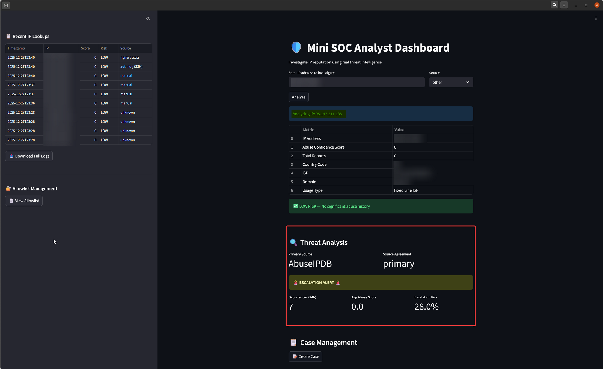
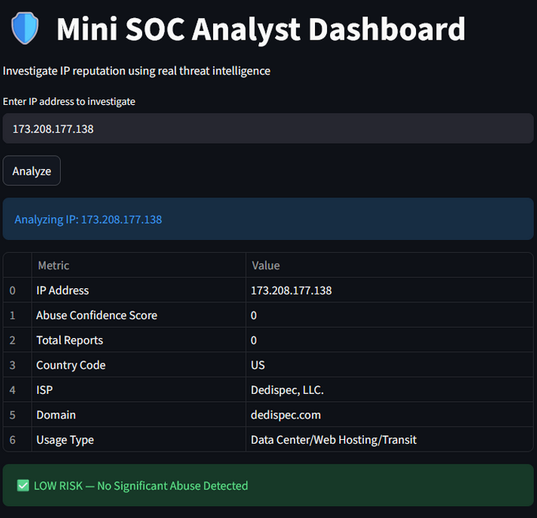
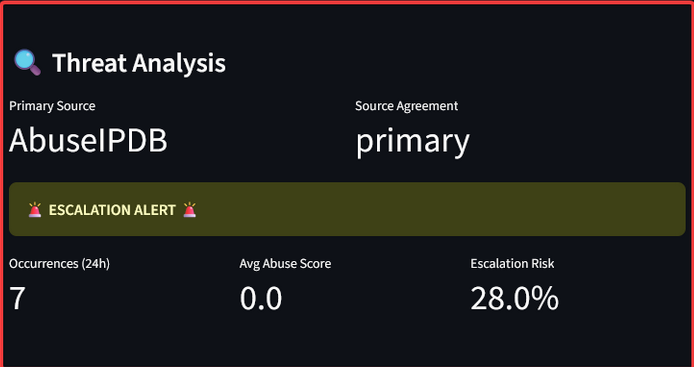

# 🔍 Mini SOC Analyst Dashboard

A lightweight Streamlit based web dashboard for Security Operations Center (SOC) analysts to quickly investigate IP address reputations using real threat intelligence from AbuseIPDB.

Perfect for blue team practice, log analysis workflows, and building a hands-on cybersecurity portfolio.

---

## 📖 About

This Mini SOC Analyst Dashboard is a simple yet powerful tool built with Python and Streamlit. It allows you to enter any IP address and instantly query AbuseIPDB for its abuse history, confidence score, recent reports, and other key indicators.

Designed to simulate real world SOC triage: check suspicious IPs from logs, firewall alerts, or IDS events without leaving your browser.

Key integrations include the AbuseIPDB API for accurate, community driven threat data. Additional features like recent lookup history, allowlist management, and case creation help mimic day-to-day analyst tasks.

Built as an educational and practical project to practice API integrations, threat intelligence enrichment, and creating intuitive security tools all in pure Python.

---

## ✨ Features

- 🔎 **Instant IP Reputation Checks** via AbuseIPDB API  
- 📊 **Detailed Metrics**: Abuse Confidence Score, Total Reports, Country, ISP, Domain, Usage Type (e.g., Fixed Line ISP)  
- ⚠️ **Threat Highlights**: Low/High Risk indicators, Escalation Alerts for IPs with notable recent activity (e.g., 28% escalation risk based on occurrences and avg score)  
- 📜 **Recent Lookups Table**: Track and review past investigations  
- 🛡️ **Allowlist Management**: Easily manage trusted IPs  
- 📁 **Case Management**: Create and organize cases for deeper investigations  
- 🧠 **Easy to Extend**: Add more threat intel sources or custom rules  

---

## 🧠 What I Learned

- Integrating third-party threat intelligence APIs (AbuseIPDB) into Python applications
- Building interactive web dashboards with Streamlit for security workflows
- Handling API responses, error management, and displaying structured threat data
- Simulating SOC processes like IP triage, risk scoring, and escalation alerts
- Designing clean, analyst-focused UIs for quick decision-making
- Best practices for API key security (using Streamlit secrets) and rate limiting
- Documenting security tools to showcase in a professional portfolio

---

## 🖼️ Examples & Screenshots

### Main Dashboard View
  
*(Screenshot of the main interface with IP input and analysis results)*

### Low Risk IP Analysis
  
*(Example of a clean IP with no significant abuse history)*

### Escalation Alert Example
  
*(Highlighting an IP with recent occurrences and elevated escalation risk)*

---

## 🛠 Requirements

- Python 3.8+
- Streamlit (`pip install streamlit`)
- Requests (`pip install requests`)
- AbuseIPDB API Key (free tier available at [abuseipdb.com](https://www.abuseipdb.com))
